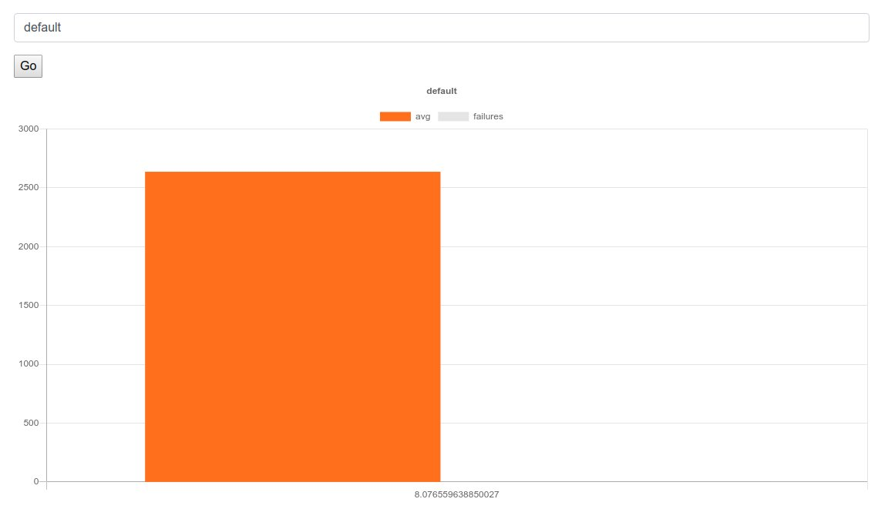

Locust Tests Runner
===================

In this repository you can find a python script to run
locust tests against your server of choice and display results
in nice looking bar charts.

Installation
============

Make sure you are updated and have pip3 installed with this command

```bash
sudo apt-get update && sudo apt-get install python3-pip -y
```

Clone this repository to your workstation using this command

```bash
git clone git@github.com:mohsenSy/locust-tests-runner.git
```

Install all dependencies using this command

```bash
sudo -H pip3 install -r requirements.txt
```

Usage
=====

To use this library first you have to prepare two files

* locustfile.py: This file describes what tests you want to run and
  against which server, there is an example file named `locustfile.example.py`
  use it as a starting point, to learn more about locust files check
  [here](https://docs.locust.io/en/stable/writing-a-locustfile.html)
* tests.json: This is a JSON file that describes the number of users,
  the number of users added per second and the duration of each test,
  here you can define many tests and run them all with a single command.

The `tests.json` file has the following structure

```json
{
  "tests": [
    {
      "users": 10,
      "rps": 5,
      "time": "1m"
    }
  ]
}
```
First we have the `tests` key which is mandatory, then we have JSON objects
for each test, these objects use the following keys:

* users: The number of user as an integer.
* rps: The number of users added per second to the test.
* time: The test duration as a string.

To run a simple test first copy the example files as follows:

```bash
cp locustfile.example.py locustfile.py
cp tests.example.json tests.json
```

Then run the test as follows:

```bash
python locust_run_tests.py
```

When the test has finished you will find a new folder called `results`, in this
folder you will  find another folder called `default` and in that folder you
will find many CSV files for the results of running each test specified.

Visualize Results
==================
After you run the tests and the results are saved inside the results folder
you can show them in a simple chart by running the `http_server` script, which
creates a web server for viewing the results as shown here.


Visit [page](http://127.0.0.1:8000/web) to view the results.
